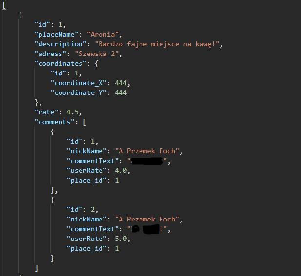

# GoDateApp - interesting places for a date :)

##### My own application which I am currently working on. Currently, the application allows you to comment and rate added places (e.g. coffee bars). 

### Currently done: 
* add place 
* add comments to a place
* edit place
* delete place with all comments 

### Current:

### What I would like to do: 
* redirection to google maps by coordinates X & Y and show the way to
* comment control system (anti-hate, 1 comment from 1 IP)
* simple front-end

### Technologies currently in use:
Project is created with:
* Java 11
* Spring Framework 5
* Spring Boot 2 (ver. 2.2.2)
* Spring Data JPA (ver. 2.3.0)
* Spring Dependency Injection
* Hibernate 
* Maven
* Project Lombok

